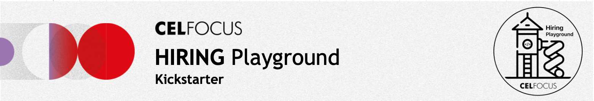

# Celfocus Hiring Playground
# <div align= "center"></div>

This is the Celfocus Hiring Playground Kickstarter. We created this project to help you in your journey to become a Celfocus Software Engineer.

You can look at this repository as a playground where you can test your skills at home, or during your technical interviews, and learn new ones!

## About the Project
> [!NOTE]
> This is intended to be an asset to our software engineering applicants.
> If you are not an applicant, you still are welcome to use this project as a learning tool.
> But if you really want to feel the full experience, [apply for a job at Celfocus!](https://careers.celfocus.com)

This is an (_incomplete_) full-stack e-commerce project containing a frontend and a backend. The frontend is a NextJs app, and the backend is a Spring Boot app.

The project acts as a quick and ready bootstrap for you to start working on your assignment(s). It includes a basic structure for both ends of the stack.

### Project Structure

```
project/
│
├── frontend/
│   ├── modules/
│   │   ├── components/
│   │   ├── services/
│   │   └── app/
│   ├── package.json
│   ├── nx.json
│   └── docker-compose.yml
│
├── backend/
│   ├── src/
│   │   ├── main/
│   │   └── test/
│   ├── pom.xml
│   └── docker-compose.yml
├── mocks/
│   ├── **.*
│   └── docker-compose.yml
│
└── docker-compose.yml
```

### Backend 
> [!NOTE]
> Please refer to the [Backend documentation](backend/README.md) for more information.

The backend is a typical [Spring Boot](https://spring.io/projects/spring-boot) application that exposes a REST API for a shopping cart. It has a basic structure with a REST controller, services, and repositories present.

### Frontend
> [!NOTE]
> Please refer to the [Frontend documentation](frontend/README.md) for more information.

The frontend is a [NextJs](https://nextjs.org) application. It is managed by [Nx](https://nx.dev) in a single mono-repo. It includes a basic structure with modules for components, services, and the app itself.

### Mocks
In the repo you will find a mock server that can be used to simulate the backend services. It provides mocks for all the services that the backend is expected to provide.

## Getting Started

### Tools Recommendations

#### IDE/ Editor
- [IntelliJ IDEA](https://www.jetbrains.com/idea/download/)
- [Visual Studio Code](https://code.visualstudio.com/download)

#### Productivity
- GitHub Copilot for [Visual Studio Code](https://marketplace.visualstudio.com/items?itemName=GitHub.copilot)
- GitHub Copilot for [JetBrains IDEs](https://plugins.jetbrains.com/plugin/17718-github-copilot)
- Any GenAI Chatbot like Chat-GPT, Gemini, etc.

### Environment
> [!TIP]
> For this project, you're expected to use a Unix-compatible OS (Linux, MacOS, WSL on Windows)
> This will make your life (_and ours_) easier.
> We encourage you to do that in all of your projects. Not just this one.

- [Docker](https://www.docker.com/get-started)
- [Docker Compose](https://docs.docker.com/compose/install/)

### Running the Project
1. Clone the repository
2. Navigate to the project root
3. Run `docker-compose up --wait` to start the project
4. This will build and run 3 containers:
    - `playground-shopping-cart-api`: the Spring Boot application
    - `playground-frontend`: the NextJs application
    - `playground-api-mocks`: the mock server

## Attributions
- Playground vector by [Freepik](https://www.freepik.com/)