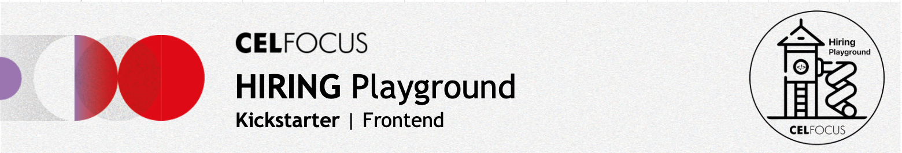

# Celfocus Hiring Playground | Frontend

# <div align= "center"></div>

This is the frontend for the Celfocus Playground Kickstarter. Here you can find the overview of the structure, and how to get started. And here you'll operate!

The frontend uses ReactJs in a [NextJs](https://nextjs.org) app. This is all managed by [Nx](https://nx.dev) in a single mono-repo.

## Project Structure

```
project/
│
├── frontend/
│   ├── modules/
│   │   ├── components/
│   │   ├── services/
│   │   └── app/
│   ├── package.json
│   ├── nx.json
│   └── docker-compose.yml
│
├── backend/
├── mocks/
└── docker-compose.yml
```

### `frontend/`

The root directory for the frontend app. It contains all the essential modules and components required to build the application.

### `modules/`

Houses the 3 isolated repositories: `components`, `services`, and `app`.

### `components/`

Contains reusable UI components categorized into atoms, molecules, and organisms, following atomic design principles.

### `services/`

Use it to write the services that interact with the backend API or any external IO. It should contain the logic for fetching data from the backend and processing it before passing it to the UI components.

> [!TIP]
> For better understanding of the api behaviour, please refer to the [API Documentation](../backend/src/main/resources/Shopping_Cart_API.yml).

### `app/`

The NextJs application logic and higher-level components that define the overall structure and behaviour of the application.

### `../mocks/`

In the root of the project, contains a mock server that can be used to simulate the backend services. It provides you mocks for these services:

```
/api/v1/
│
├── products
│
└── carts/
    │
    └── items
```

The mock server is built using `json-server` and can be started using the following command:

```bash
npm install -g json-server@v0.17.4
cd mocks
json-server -w apis-mock.json --routes routes.json --port 8082
```

> [!IMPORTANT]
> You don't need this command if you are already running the root docker-compose file–it will start the mock server and the backend automatically.

## Key Features

### 1. User Interface

**_Responsive Design_**: The application is designed to work seamlessly across different devices and screen sizes.

### 2. Product Catalog

**_Product Listing_**: Displays a grid of products fetched from the Product Catalog API.

**_Product Card_**: Allows users to view the information about each product, including image, description and price.

> [!TIP]
> The `ProductCard` is already implemented in the `components` module. You can use it as a reference to build the rest of the components.

### 3. Shopping Cart

**_Add to Cart_**: Users can add products to their shopping cart.

**_View Cart_**: Displays the items in the user's shopping cart, including product names, quantities, and prices.

## Running the Project

> [!NOTE]  
> You don't generally need to run the frontend and mocks separately. The root `docker-compose.yml` file will start both the frontend, mocks, and backend services.

To run the project locally, follow these steps:

1.  **Clone the Project repository to your local machine.**

2.  **Install Dependencies**: Ensure all necessary dependencies are installed:

    ```bash
    cd frontend
    npm install
    ```

3.  **Start the Frontend**: To start the frontend React application:
    ```bash
    npm start
    ```

The application should now be running at http://localhost:4200.

## Components Testing

We use storybook to test the components. To run the storybook, use the following command:

```bash
cd frontend/modules/components
npm run storybook
```
Now navigate to http://localhost:4400/ to see your components.
